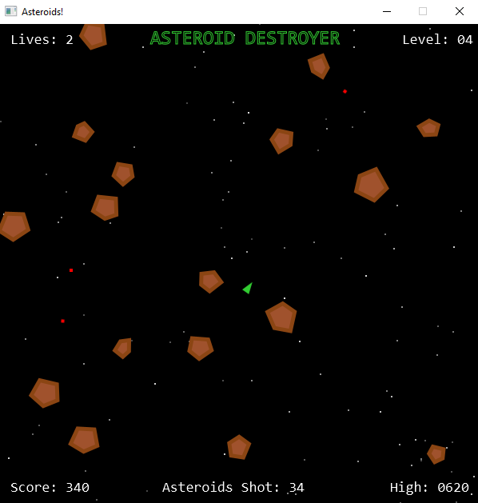
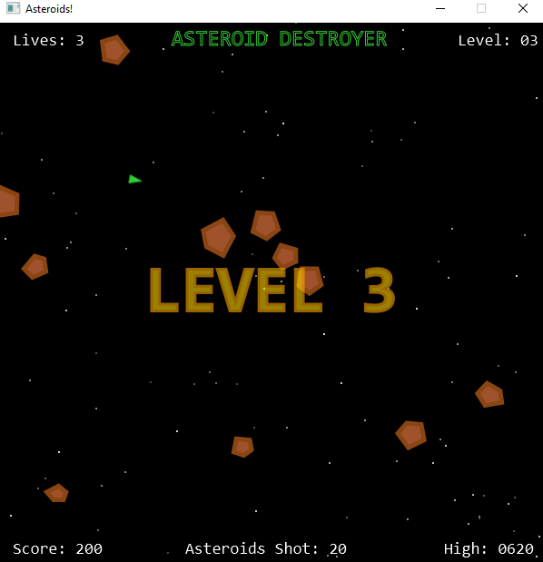
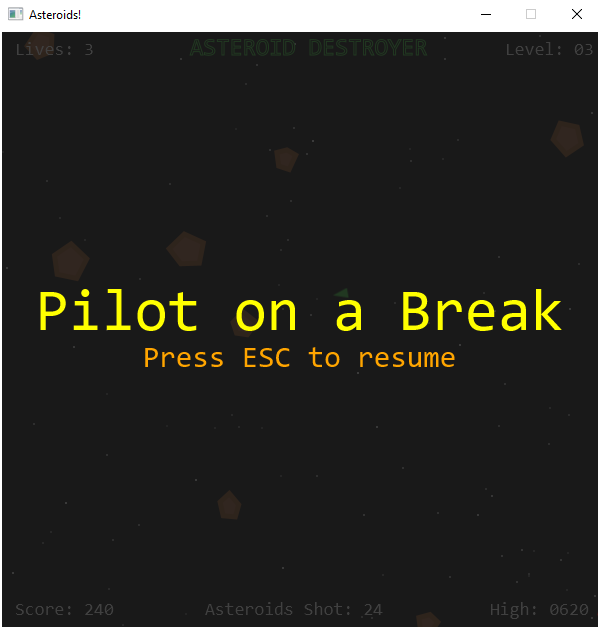
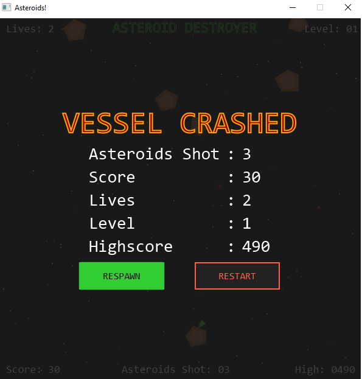
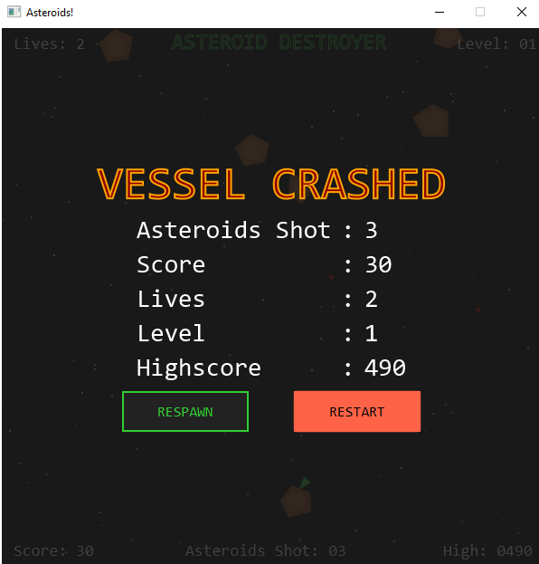
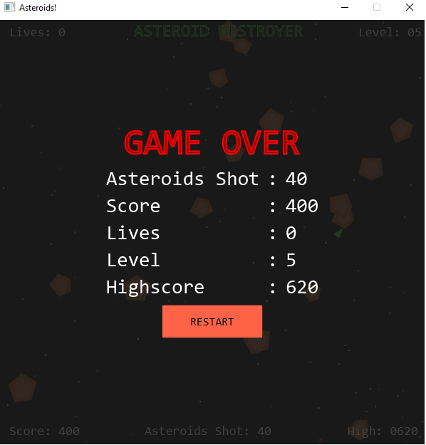

# ☄️ Asteroid Destroyer using JavaFX


A desktop-based Asteroids-inspired arcade game developed using JavaFX.
Control a spaceship, destroy incoming asteroids, survive increasingly difficult levels, and achieve the highest score possible.

---

## ✨ Features

* 🚀 Ship movement with rotation and acceleration
* 🔫 Projectile shooting system
* ☄️ Randomly generated asteroid shapes
* 💥 Collision detection system
* 📈 Dynamic difficulty progression
* 🏅 Level-up system with visual effects
* ❤️ Multiple lives and respawn functionality
* 🛡️ Temporary invulnerability after respawn
* ⏸️ Pause and resume support
* 🔊 Sound effects for gameplay events
* 💾 Persistent high score storage
* 🎨 CSS-styled UI and overlays
* 📦 Runnable JAR support

---

## 🛠️ Technologies Used

* Java 17
* JavaFX
* Maven
* CSS
* Object-Oriented Programming

---

## 📂 Project Structure

```text
src
├── main
│   ├── java
│   │   └── com.asteroids
│   │       ├── Launcher.java
│   │       ├── AsteroidsApplication2.java
│   │       ├── model
│   │       │   ├── Character.java
│   │       │   ├── Ship.java
│   │       │   ├── Asteroid.java
│   │       │   └── Projectile.java
│   │       └── util
│   │           ├── Constants.java
│   │           ├── PolygonFactory.java
│   │           └── SoundPlayer.java
│   └── resources
│       ├── sounds
│       │   ├── crash.wav
│       │   ├── explosion.wav
│       │   ├── gameover.wav
│       │   ├── levelup.wav
│       │   ├── pause.mp3
│       │   ├── play.wav
│       │   └── shoot.wav
│       └── style
│           └── game.css
```

---

## 🎮 Controls

| Key   | Action         |
| ----- | -------------- |
| ←     | Rotate Left    |
| →     | Rotate Right   |
| ↑     | Accelerate     |
| SPACE | Shoot          |
| ESC   | Pause / Resume |

---

## ▶️ How to Run

Make sure Java 17 or higher and Apache Maven 3.9+ is installed.

### Option 1 — Run using IDE

1. Open project in Eclipse / STS / IntelliJ IDEA
2. Run `Launcher.java`

---

### Option 2 — Run using batch file (Windows)

Double click:

```text
run.bat
```

---

### Option 3 — Run using command line (Windows)

Run in root folder:

```text
mvn javafx:run
```

---

## 📸 Screenshots

### Gameplay



### Level Up



### Pause Menu



### Vessel Crashed Screen (Resume selected)



### Vessel Crashed Screen (Restart selected)



### Game Over Screen



---

## 🧠 Concepts Practiced

* JavaFX GUI development
* AnimationTimer game loop
* Object-Oriented Programming
* Collision detection
* Event handling
* Collections Framework
* File handling and persistence
* CSS styling
* State management
* Game development fundamentals
* Code refactoring and maintainability
